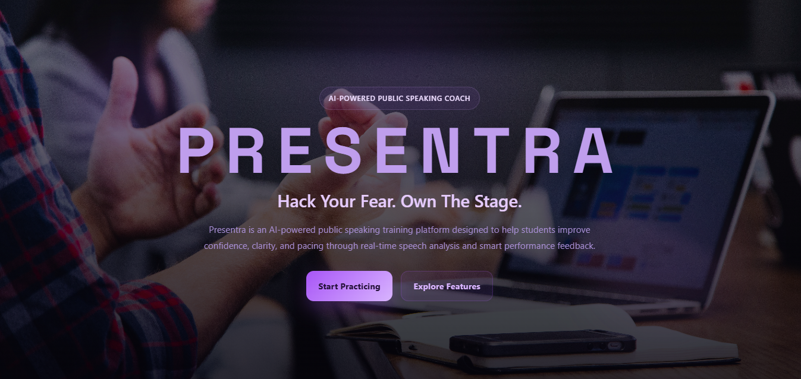
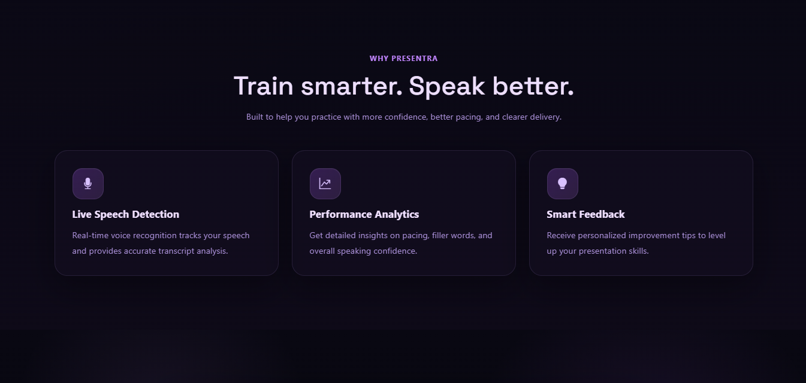
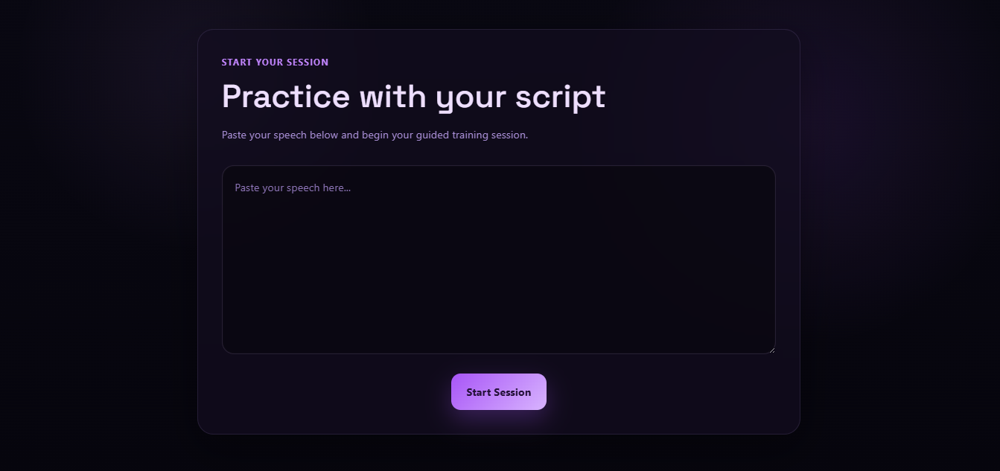
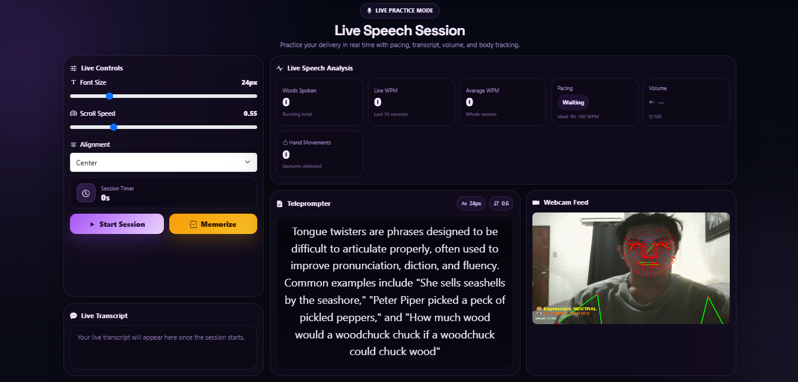
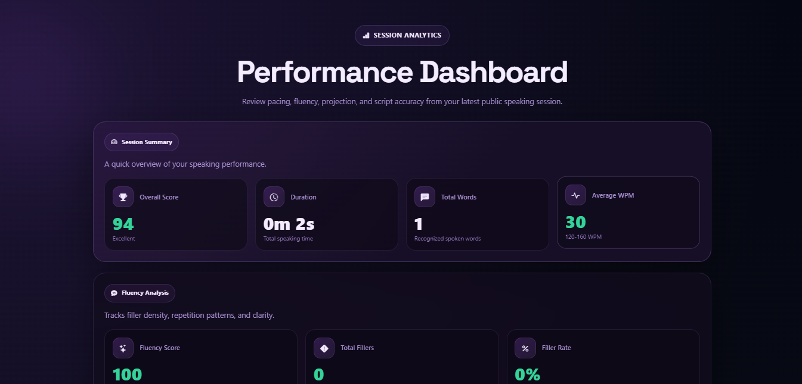
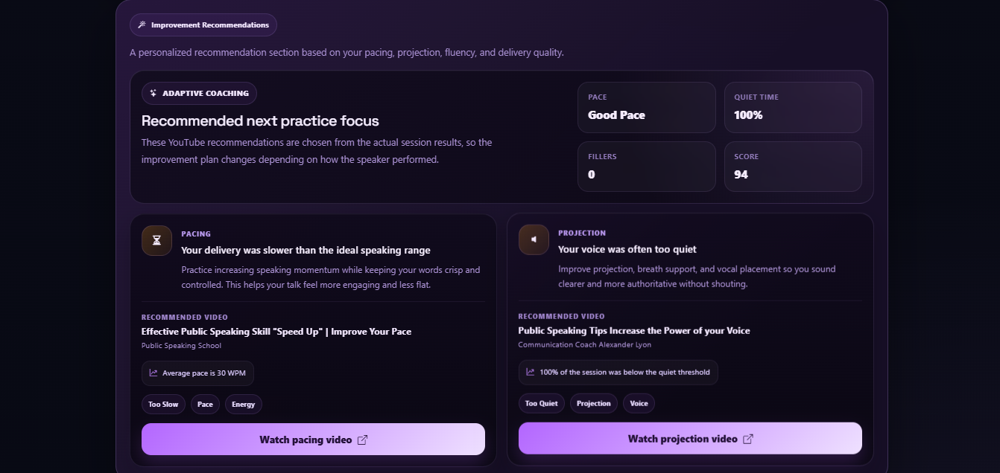

<p align="left">
  
</p>


# PRESENTRA

<p align="center">
  <b>Hack your fear. Own the stage.</b>
</p>

<p align="center">
  Presentra is an AI-powered public speaking trainer that helps students improve confidence, clarity, and delivery through real-time speech analysis and instant feedback. It transforms presentation anxiety into measurable growth.
</p>

<p align="center">
  
  
  
  
  
  

</p>

<p align="center">
  <a href="https://presentra.onrender.com/" target="_blank"><b>Live Demo</b></a>
</p>

---

## Overview

Presentra is a web-based public speaking training platform built with React. It is designed to help students practice presentations in a more guided, interactive, and measurable way. Instead of practicing blindly, users can input a speech script, enter a live teleprompter session, speak in real time, and receive analytics-based feedback after the session.

The platform was created to address a common student problem: many students know their topic well, but struggle with delivery because of nervousness, poor pacing, and lack of effective practice tools. Presentra turns practice into structured improvement.

---

## Problem Statement

Many students experience difficulty when speaking in front of a class, reporting a topic, defending a project, or presenting ideas. Common issues include:

- Fear of public speaking
- Lack of confidence
- Overuse of filler words
- Poor pacing
- Limited access to structured speaking feedback

Traditional practice methods often do not provide measurable insights. Presentra solves this by combining teleprompting, speech recognition, and analytics into one platform.

---

## Key Features

### Landing Page
- Professional introduction to Presentra
- Clear explanation of the platform’s purpose
- Structured sections for branding, overview, and call to action
- Footer with complete website information

### Script Input Page
- Text area for users to paste or write their speech script
- Clean and focused setup experience
- Direct transition into the live session

### Live Teleprompter Session
- Full-screen teleprompter-style presentation view
- Real-time script display
- Live line progression based on speech recognition
- Active line highlighting for better focus
- Auto-scroll behavior centered on the current line
- Start and stop listening controls
- Adjustable text presentation options such as font size and alignment

### Speech Recognition
- Browser-based real-time voice capture
- Tracks spoken words while the user is reading
- Matches spoken content with script lines
- Advances through the script based on reading progress

### Speech Analysis
- Calculates total words spoken
- Calculates speaking speed in words per minute
- Detects filler words such as:
  - um
  - uh
  - like
  - ah
  - so
  - you know
- Measures filler word frequency and filler rate
- Evaluates pacing against an ideal speaking range

### Analytics Dashboard
- Overall performance score
- Performance level classification
- Speech summary with session duration, total words, and speaking speed
- Fluency analysis with filler count and filler word breakdown
- Pacing analysis with ideal speaking range comparison
- Structured improvement feedback for the user

### User Experience
- Responsive layout
- Clear navigation between pages
- Professional and modern interface
- Lightweight and browser-accessible implementation

---

## Tech Stack

### Frontend
- React
- React Router DOM
- Bootstrap

### Browser APIs
- Web Speech API

### Core Logic
- Real-time speech recognition
- Line progression matching
- Filler word detection
- Words-per-minute calculation
- Session scoring and feedback generation

---

## Project Structure

```bash
src/
├── components/
│   └── Footer.jsx
├── pages/
│   ├── Home.jsx
│   ├── Session.jsx
│   └── Dashboard.jsx
├── App.jsx
└── main.jsx